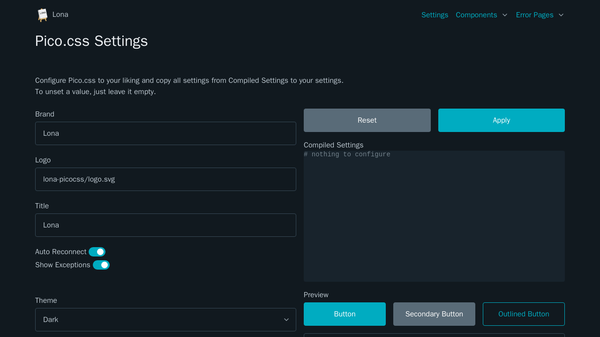

# lona-picocss

lona-picocss provides highly customizable [Pico.css](https://picocss.com/) bindings for [Lona](https://lona-web.org)




## Installation

lona-picocss can be installed using pip

```
pip install lona lona-picocss
```


## Topics

 - [Getting Started](doc/getting-started.md)
 - [Customization](doc/customization.md)
 - [Components](doc/components.md)
