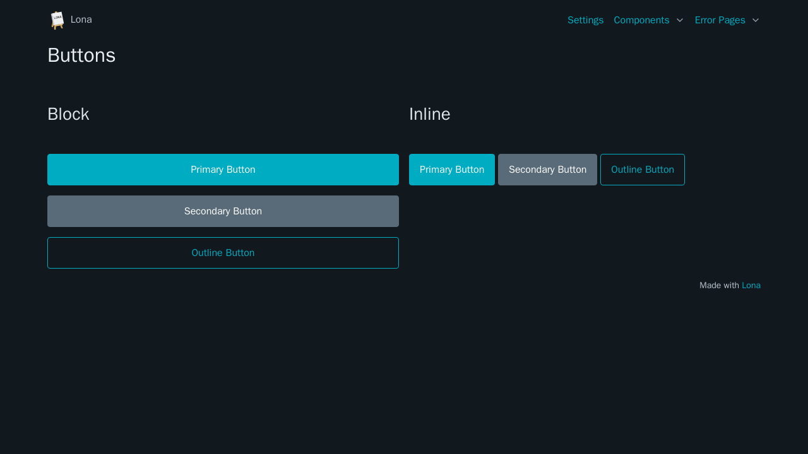

# Buttons



```python
from lona_picocss.html import HTML, Button, InlineButton, H1
from lona import View


class ButtonsView(View):
    def handle_request(self, request):

        return HTML(
            H1('Buttons'),

            Button('Button'),
            InlineButton('Inline Button', outline=True),
        )
```

## Arguments

| Name | Type | Description |
| - | - | - |
| secondary | bool | Secondary styling |
| outline | bool | Outline styling |


## Properties

| Name | Type | Description |
| - | - | - |
| secondary | bool | Secondary styling |
| outline | bool | Outline styling |
