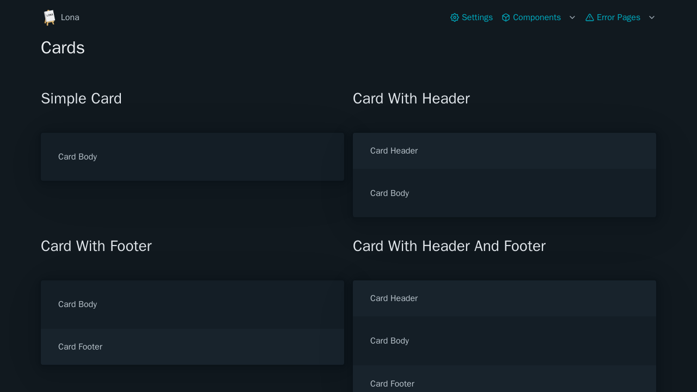

# Cards



```python
from lona_picocss.html import HTML, Card, H1
from lona import View


class CardsView(View):
    def handle_request(self, request):

        return HTML(
            H1('Card'),
            Card(
                'Card Body',
                header='Card Header',
            ),
        )
```

## Arguments

| Name | Type | Description |
| - | - | - |
| header | Node \| None | Initial card header |
| footer | Node \| None | Initial card footer |


## Methods

| Name | Return Type | Description |
| - | - | - |
| get_header() | Node | Gets or creates a card header |
| get_footer() | Node | Gets or creates a card footer |
