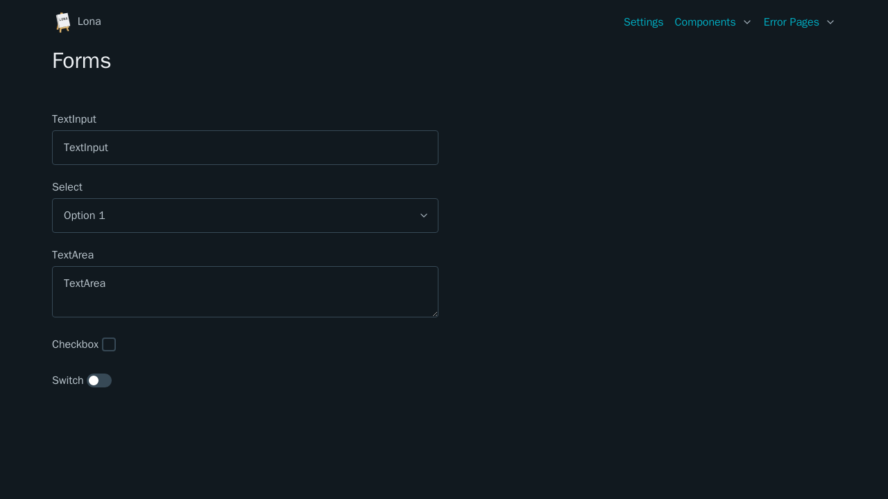

# Forms



## Switch

lona-picocss switches work like [Lona CheckBoxes](https://lona-web.org/1.x/end-user-documentation/html.html#checkbox)


```python
from lona_picocss.html import HTML, H1, Label, Switch
from lona import View


class FormsView(View):
    def handle_request(self, request):
        return HTML(
            H1('Switch'),
            Label(
                'Switch ',
                Switch(),
            ),
        )
```
