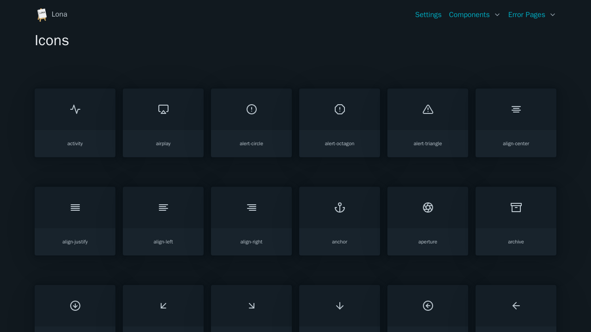

# Icons

All icons are based on [Feather](https://feathericons.com/)



```python
from lona_picocss.html import HTML, Icon, H1
from lona_picocss import install_picocss
from lona import View, App

app = App(__file__)

install_picocss(app, debug=True)


@app.route('/')
class IconsView(View):
    def handle_request(self, request):
        return HTML(
            H1('Icons'),

            Icon('activity'),
            Icon('alert-circle'),
        )


app.run()
```

## Arguments

| Name | Type | Description |
| - | - | - |
| name | String | Name of the icon. A list is available in `/_picocss/components/icons` when in debug mode, or at https://feathericons.com/ |
| stroke_width | Any | Stroke width of the icon |
| height | Any | Height of the icon |
| width | Any | Width of the icon |
| color | Any | Color of the icon |

## Properties

| Name | Type | Description |
| - | - | - |
| stroke_width | Any | Stroke width of the icon |
| height | Any | Height of the icon |
| width | Any | Width of the icon |
| color | Any | Color of the icon |
