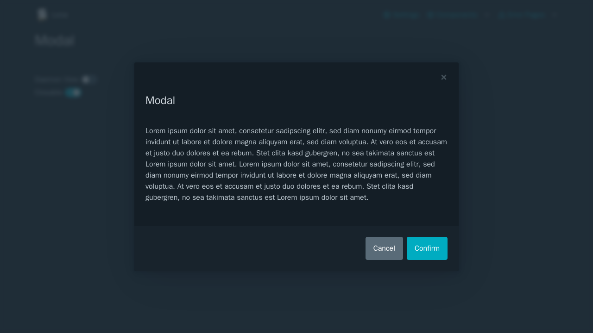

# Modal



```python
from lona_picocss.html import HTML, Modal, InlineButton, H1, H3, P
from lona import View


class ModalView(View):
    def handle_request(self, request):
        self.modal = Modal()

        # set modal body
        self.modal.get_body().nodes = [
            H3('Modal'),
            P("""
                Lorem ipsum dolor sit amet, consetetur sadipscing elitr, sed
                diam nonumy eirmod tempor invidunt ut labore et dolore magna
                aliquyam erat, sed diam voluptua. At vero eos et accusam et
                justo duo dolores et ea rebum. Stet clita kasd gubergren, no
                sea takimata sanctus est Lorem ipsum dolor sit amet. Lorem
                ipsum dolor sit amet, consetetur sadipscing elitr, sed diam
                nonumy eirmod tempor invidunt ut labore et dolore magna
                aliquyam erat, sed diam voluptua. At vero eos et accusam et
                justo duo dolores et ea rebum. Stet clita kasd gubergren, no
                sea takimata sanctus est Lorem ipsum dolor sit amet.
            """)
        ]

        # set modal footer
        self.modal.get_footer().nodes = [
            InlineButton(
                'Cancel',
                secondary=True,
                handle_click=lambda i: self.modal.close(),
            ),
            InlineButton(
                'Confirm',
                handle_click=lambda i: self.modal.close(),
            ),
        ]

        return HTML(
            H1('Modal'),
            InlineButton('Open Modal', handle_click=lambda i: self.modal.open()),
            self.modal,
        )
```

## Arguments

| Name | Type | Description |
| - | - | - |
| closable | bool | When set to `True`, the modal can be closed without clicking on of its buttons |


## Properties

| Name | Type |Description |
| - | - | - |
| closable | bool | When set to `True`, the modal can be closed without clicking on of its buttons |


## Methods

| Name | Return Type | Description |
| - | - | - |
| open() | None | open or "show" modal |
| close() | None | close or "hide" modal |
| get_body() | Node | get or create a body |
| get_footer() | Node | get or create a footer |
