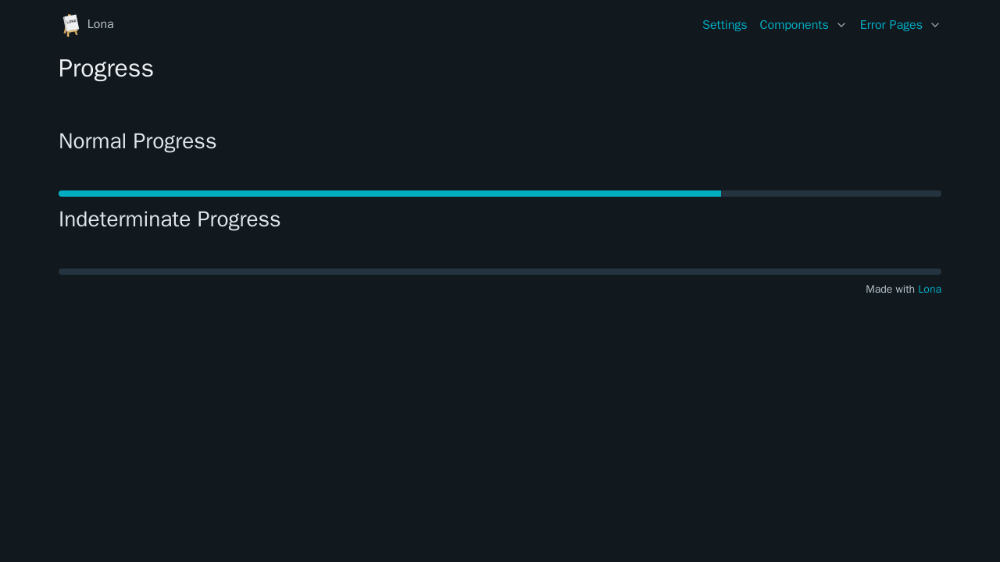

# Progress



```python
from lona_picocss.html import HTML, Progress, H1, H2
from lona_picocss import install_picocss
from lona import View, App

app = App(__file__)

install_picocss(app, debug=True)


@app.route('/')
class ProgressView(View):
    def handle_request(self, request):
        self.set_title('Progress')

        return HTML(
            H1('Progress'),

            H2('Normal Progress'),
            Progress(value=75),

            H2('Indeterminate Progress'),
            Progress(value=None),
        )


app.run()
```

## Arguments

| Name | Type | Description |
| - | - | - |
| value | int \| None | Value of the progress. When set to `None`, the progress goes into indeterminate mode |


## Properties

| Name | Type | Description |
| - | - | - |
| value | int \| None | Value of the progress. When set to `None`, the progress goes into indeterminate mode |
