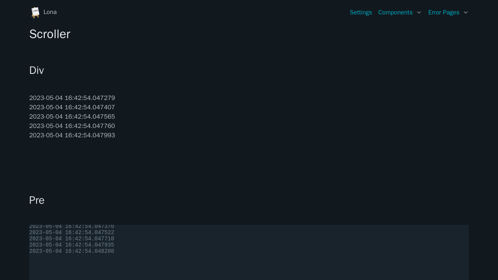

# Scroller

Scroller implement the basic behavior of terminals or chat windows: they always
stay scrolled down when a new line gets appended or inserted.




```python
from datetime import datetime

from lona_picocss.html import HTML, H1, Label, ScrollerDiv
from lona_picocss import install_picocss
from lona import View, App

app = App(__file__)

install_picocss(app, debug=True)


@app.route('/')
class ScrollerView(View):
    def handle_request(self, request):
        self.scroller_div = ScrollerDiv(
            height='8em',
        )

        self.html = HTML(
            H1('Scroller'),
            self.scroller_div,
        )

        while True:
            self.scroller_div.append(
                Div(f'{datetime.now()}\n'),
            )

            self.show(self.html)
            self.sleep(1)


app.run()
```

## Arguments

| Name | Type | Description |
| - | - | - |
| width | str | Component width |
| height | str | Component height |
| lines | int \| None | Max lines |


## Properties

| Name | Type | Description |
| - | - | - |
| width | str | Component width |
| height | str | Component height |
| lines | int \| None | Max lines |
| body | Node | Node that holds all lines |
| anchor | Node | Scroll anchor node |


## Methods

| Name | Return Type | Description |
| - | - | - |
| append(node) | None | Append node to `body` and trim if `lines` is set |
| extend(node_list) | None | Extend `body.nodes` and trim if `lines` is set |
| clear() | None | Clear lines |
