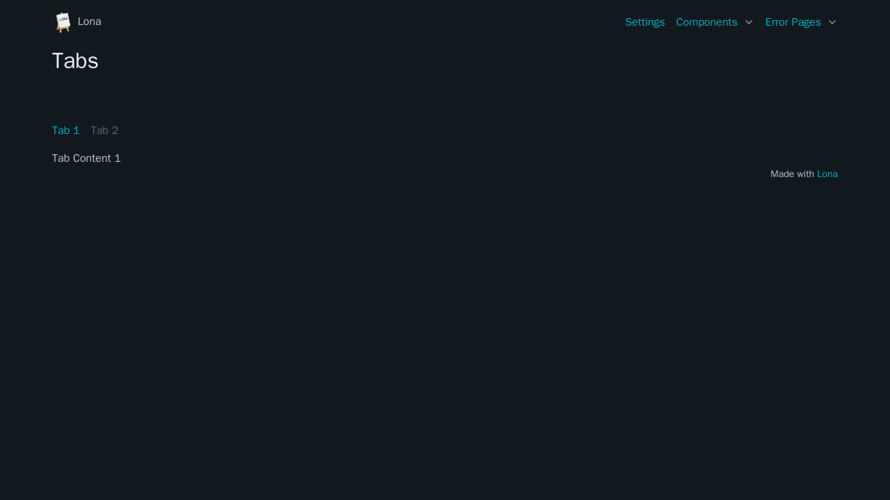

# Tabs



```python
from lona_picocss.html import HTML, Tabs, H1
from lona_picocss import install_picocss
from lona import View, App

app = App(__file__)

install_picocss(app, debug=True)


@app.route('/')
class TabsView(View):
    def handle_request(self, request):
        return HTML(
            H1('Tabs'),
            Tabs(
                'Tab 1',
                ['Tab Content 1'],
                'Tab 2',
                ['Tab Content 2'],
            ),
        )


app.run()
```

## Arguments

| Name | Type | Description |
| - | - | - |
| tabs | List[str, List[Node, str]] | Alternating list of tab names and tabs |


## Methods

| Name | Return Type | Description |
| - | - | - |
| get_tab(name) | Node | Gets or creates a tab with given tab name |
