# Customization

lona-picocss comes with a visual theme configuratior built-in.
Make sure you [installed](./getting-started.md#getting-started) lona-picocss with `debug` set to `True`, and go to `/_picocss/settings`.
The configurator applies all changes live. After you are done, copy all settings from `Compiled Settings` into your script, to make your changes permanent.


## Menu

The default template of lona-picocss has support for a menu at the top. To configurate its contents set `settings.PICOCSS_MENU`, like in this example.
When `app.settings.PICOCSS_MENU` is set to an empty list, the menu does not get rendered.

```python
app.settings.PICOCSS_MENU = [
    ['Simple Link', '/home'],
    ['Dropdown', [
        ['Dropdown Link 1', '/dropdown/link-1/'],
        ['Dropdown Link 1', '/dropdown/link-1/'],
    ]],
    ['Reverse URL', '!picocss__settings'],
]
```


## Themes

lona-picocss has support for light and dark themes

### Light
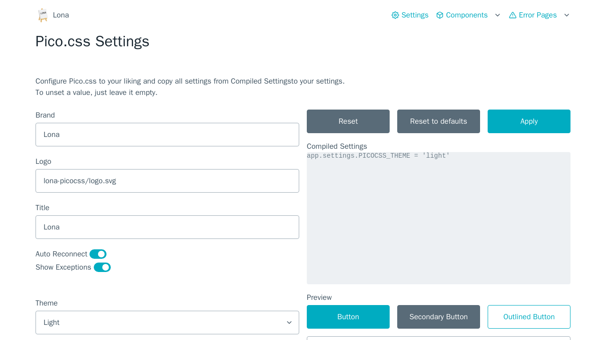

### Dark
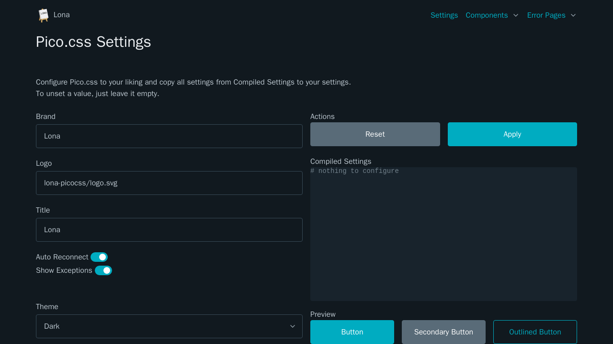


## Color Schemes

lona-picocss has support for a list of different color schemes. All of them can be used with light- and dark theme.

### Amber
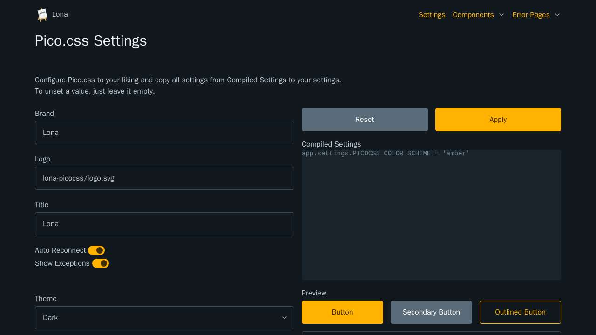

### Blue
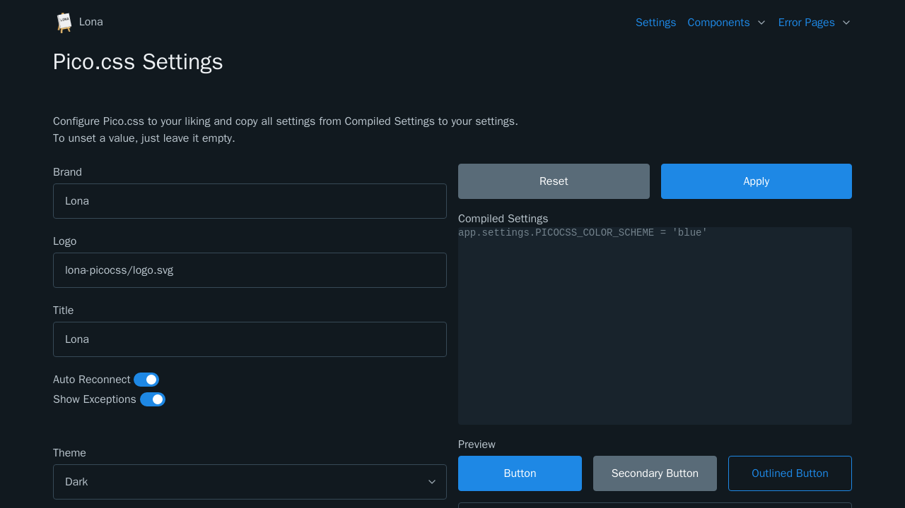

### Blue Grey
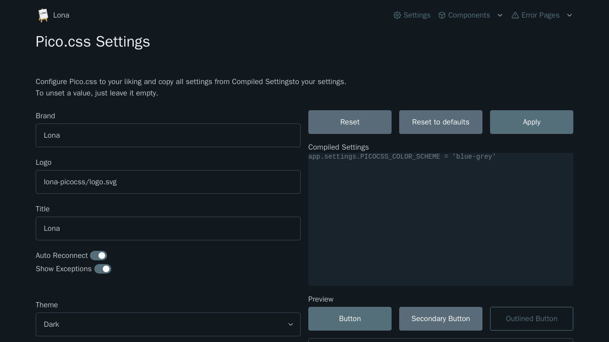

### Cyan
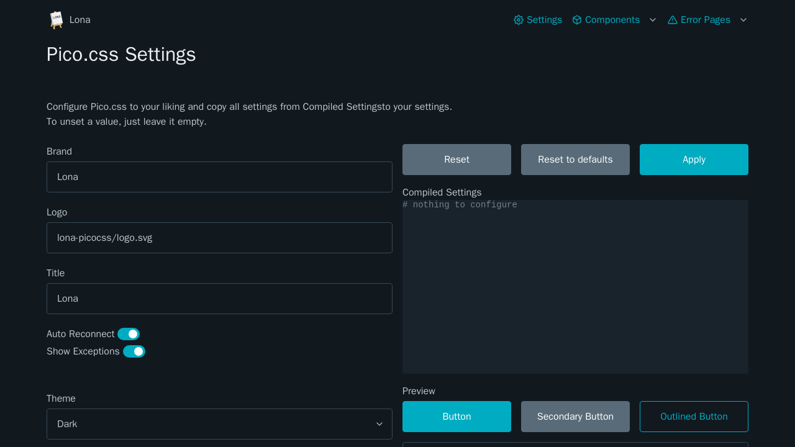

### Deep Orange
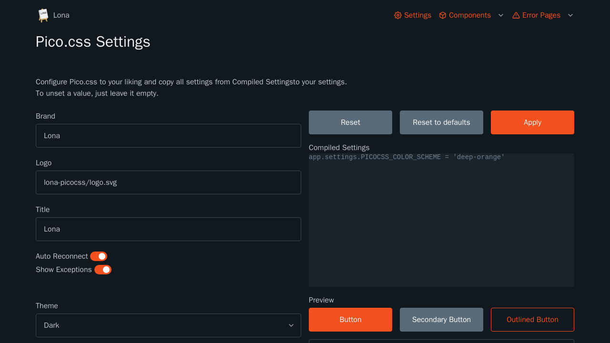

### Deep Purple
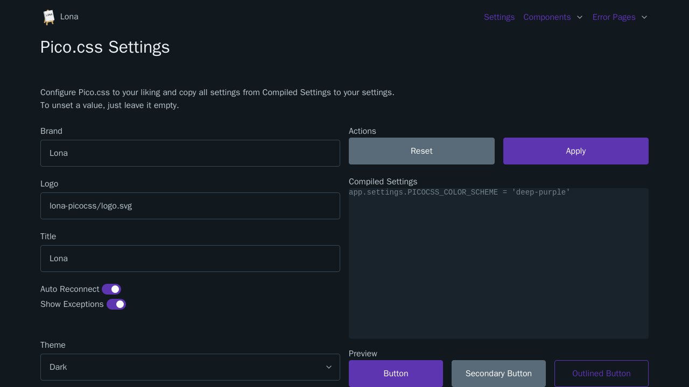

### Green
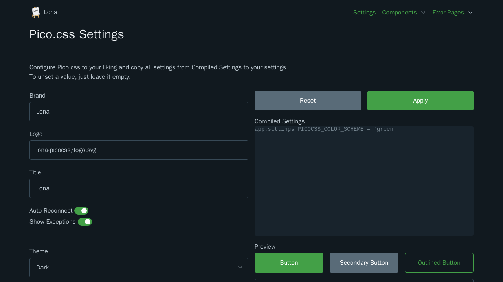

### Gray


### Indigo
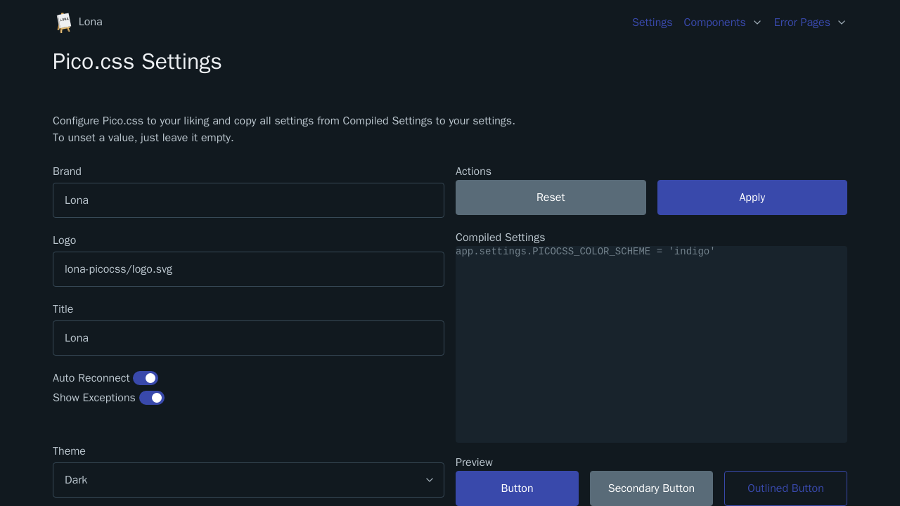

### Light Blue
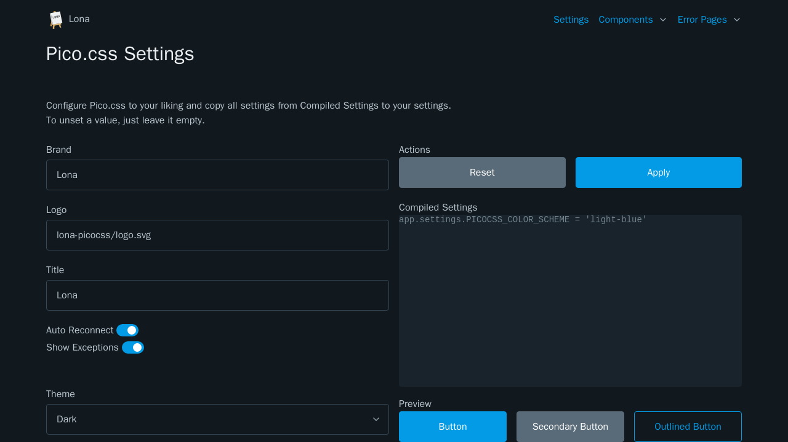

### Light Green
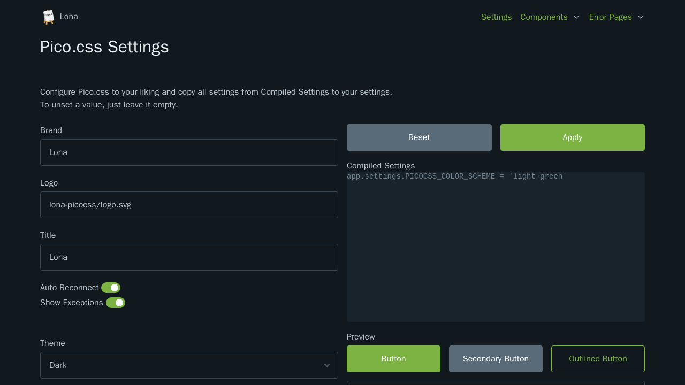

### Lime


### Orange
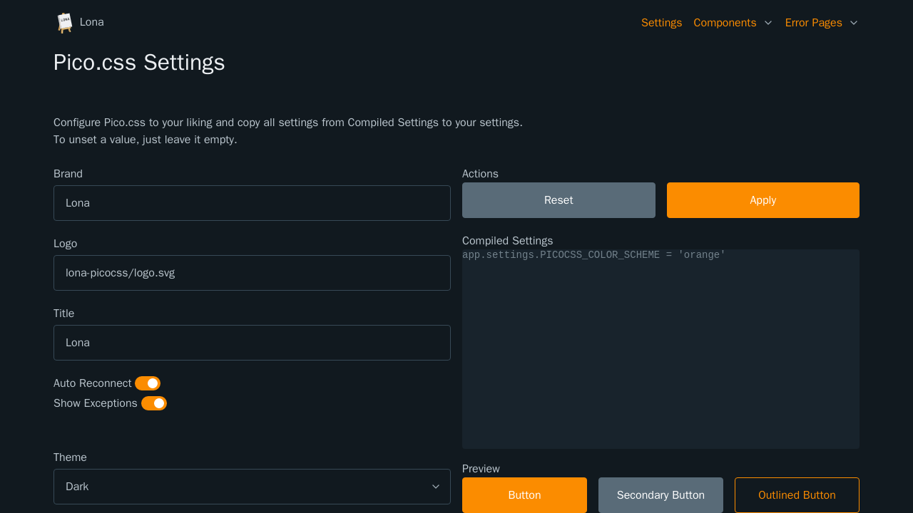

### Pink
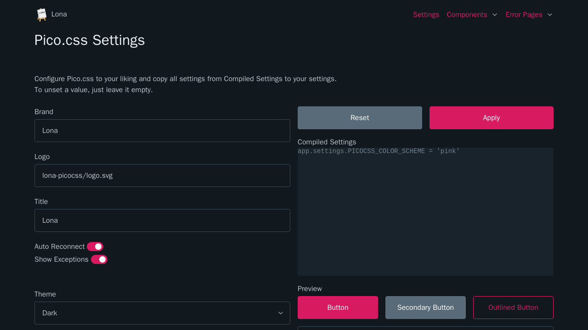

### Purple
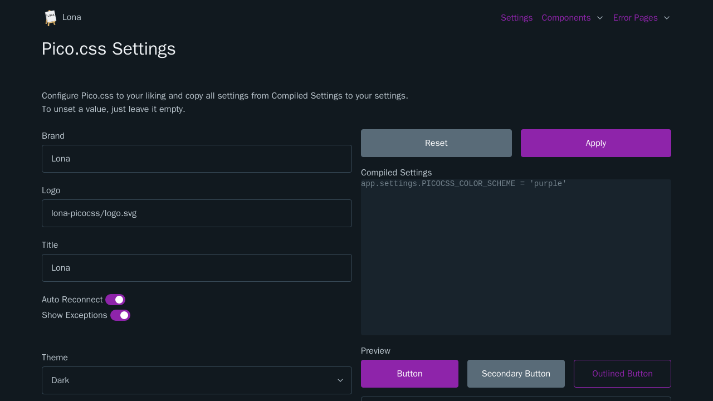

### Red
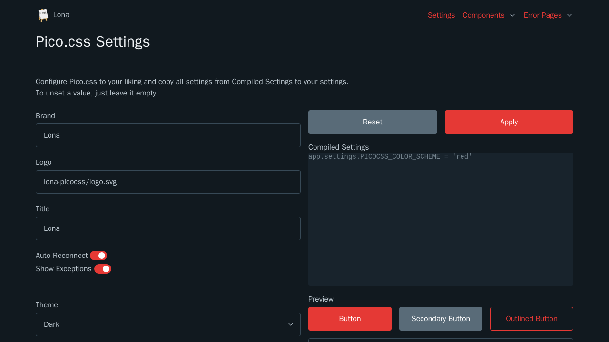

### Teal
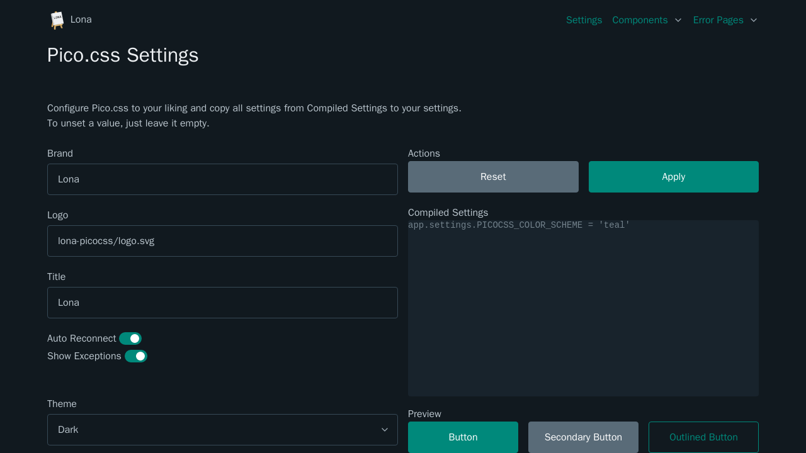

### Yellow
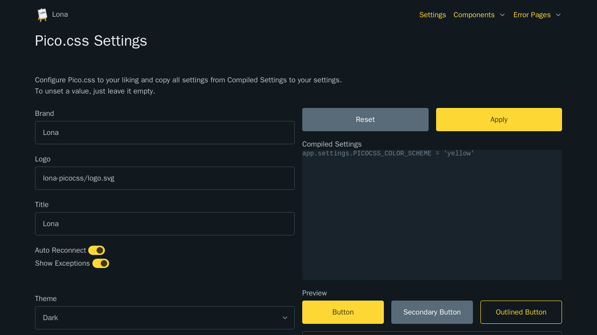
