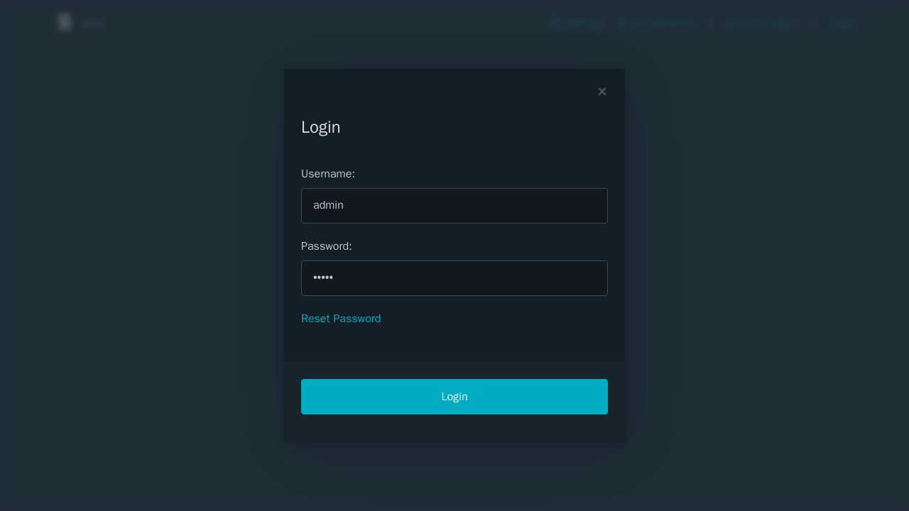

# Django

lona-picocss has full support for Djangos auth system and all of its templates. To set up Django to use lona-picocss's templates, three files have to be patched, and lona-django has to be installed.



```
$ pip install lona-django
```

## Lona Settings

```python
# Lona settings.py

from lona_picocss import (
    get_django_auth_navigation,
    Error403View,
    Error404View,
    Error500View,
    settings,
    NavItem,
)

ROUTING_TABLE = 'routes.py::routes'

CLIENT_VERSION = 2

# middlewares
MIDDLEWARES = [
    'lona_picocss.middlewares.LonaPicocssMiddleware',
    'lona_django.middlewares.DjangoSessionMiddleware',
]

# static files
STATIC_DIRS.extend([
    'static',
    settings.STATIC_DIR,
])

# templating
TEMPLATE_DIRS.append(settings.TEMPLATE_DIR)

FRONTEND_TEMPLATE = settings.FRONTEND_TEMPLATE
ERROR_403_VIEW = Error403View
ERROR_404_VIEW = Error404View
ERROR_500_VIEW = Error500View

# navigation
def get_navigation(server, request):
    nav_items = [
        NavItem(
            title='Home',
            url='/',
        ),
    ]

    # django auth navigation
    nav_items.extend(get_django_auth_navigation(server, request))

    return nav_items


PICOCSS_NAVIGATION = get_navigation
```

## Django Settings

```python
# Django settings.py

INSTALLED_APPS = [
    'lona_picocss',
    # [...]
]

```

## Django URLs

```python
# Django urls.py

handler403 = 'lona_picocss.views.handler403'
handler404 = 'lona_picocss.views.handler404'
handler500 = 'lona_picocss.views.handler500'
```
